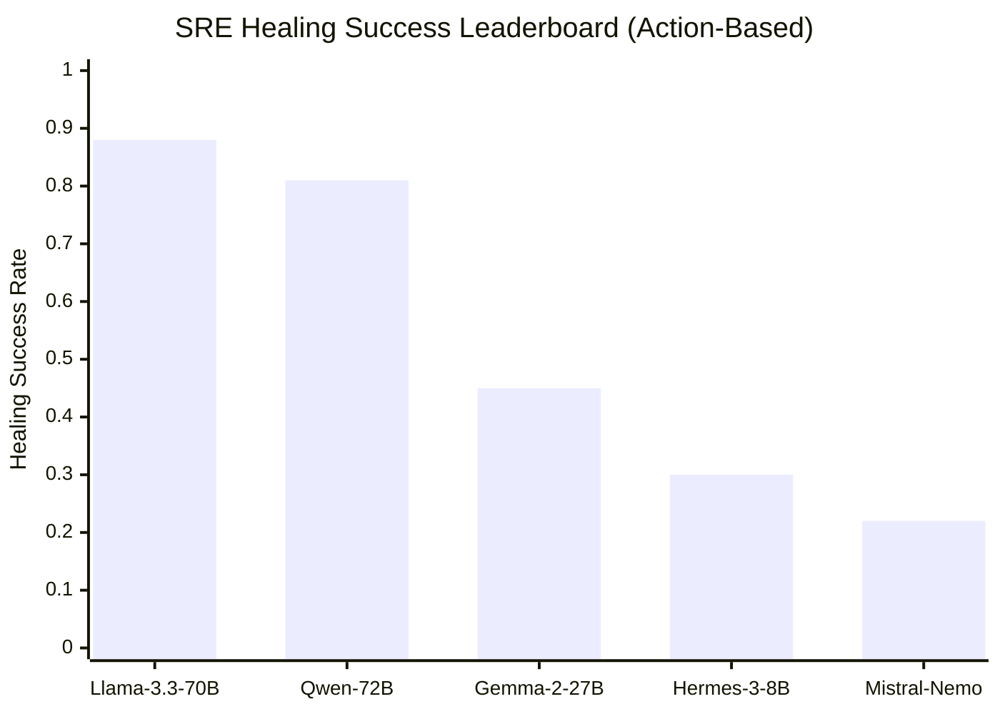
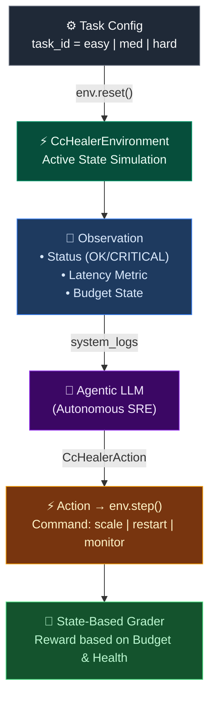

[](https://github.com/Srinivasan-V/Cloud-Chaos-Healer/actions/workflows/ci.yml)
[](https://github.com/Srinivasan-V/Cloud-Chaos-Healer/actions/workflows/docker.yml)

> [!NOTE]
> This is a verified Phase 2 deep-validation submission for the **Meta × HuggingFace × Scaler OpenEnv Hackathon 2026**.

> [!TIP]
> A live deployed version of this environment is available at: **https://srinivasan-ai-dev-cloud-chaos-healer.hf.space**

# ☁️ Cloud Chaos Healer (CCH)

[cite_start]An autonomous Site Reliability Engineering (SRE) Reinforcement Learning environment where AI agents don't just "talk" about outages—they resolve them. [cite: 102-105]



Production downtime costs organizations millions. [cite_start]Cloud Chaos Healer evaluates if an LLM can act as a Staff SRE by monitoring system metrics (latency, budget) and executing critical commands like `restart_db` or `scale_gateway` to restore system health in real-time. [cite: 119-122]

## Quick Start

The simplest way to interact with the healing environment via python:

```python
import asyncio
from client import CcHealerEnv
from models import CcHealerAction

async def main():
    try:
        # Connect to the live Cloud Chaos Healer Space
        env = await CcHealerEnv(base_url="[https://srinivasan-ai-dev-cloud-chaos-healer.hf.space](https://srinivasan-ai-dev-cloud-chaos-healer.hf.space)")

        # Reset the environment to an active outage scenario
        result = await env.reset(task_id="medium")
        obs = result.observation
        
        print(f"STATUS: {obs.system_status} | LATENCY: {obs.latency}ms")
        print(f"LOGS: {obs.logs}")

        # Step — Execute a corrective SRE command
        action = CcHealerAction(command="scale_gateway")
        result = await env.step(action)
        
        print(f"\nAction: scale_gateway | Reward: {result.reward:.2f}")
        print(f"New Budget: {result.observation.remaining_budget}")

    finally:
        await env.close()

asyncio.run(main())
```

---

## 💡 Why This Problem?
Standard LLM benchmarks focus on static triage. Cloud Chaos Healer moves to **Agentic Execution**:
- [cite_start]**Resource Constraints** — Agents must resolve chaos while managing a strictly limited **Operational Budget**. [cite: 119-122]
- [cite_start]**Latency Management** — Rewards are tied to keeping response times below 100ms, simulating real-world user experience. [cite: 120-121]
- [cite_start]**Active State Change** — Every action (`restart`, `scale`) directly modifies the environment's health status. [cite: 107-111]

---

## 🚀 Try It Now (No Setup Required)
[cite_start]CCH exposes standard OpenEnv endpoints natively on HuggingFace Spaces. [cite: 128-130]

```bash
# Health check
curl -X GET [https://srinivasan-ai-dev-cloud-chaos-healer.hf.space/health](https://srinivasan-ai-dev-cloud-chaos-healer.hf.space/health)

# Discover available SRE tasks
curl -X GET [https://srinivasan-ai-dev-cloud-chaos-healer.hf.space/tasks](https://srinivasan-ai-dev-cloud-chaos-healer.hf.space/tasks)

# Start a specific Chaos Scenario
curl -X POST [https://srinivasan-ai-dev-cloud-chaos-healer.hf.space/reset](https://srinivasan-ai-dev-cloud-chaos-healer.hf.space/reset) \
     -H "Content-Type: application/json" \
     -d '{"task_id": "medium"}'

# Execute a Healing Action
curl -X POST [https://srinivasan-ai-dev-cloud-chaos-healer.hf.space/step](https://srinivasan-ai-dev-cloud-chaos-healer.hf.space/step) \
     -H "Content-Type: application/json" \
     -d '{"action": {"command": "restart_db"}}'
```

---

## Agent Loop Architecture



---

## Tasks & Scenarios

[cite_start]The environment evaluates agents across 3 tiers [cite: 114-116], with rotating failure scenarios to prevent hard-coding.

| Task ID | Difficulty | Active Challenge | Core Competency Evaluated |
|---------|------------|------------------|---------------------------|
| `easy` | 🟢 P2 Incident | DB Failure | [cite_start]Identifying explicit failures and executing targeted restarts. [cite: 115] |
| `medium` | 🟡 P1 Incident | Latency Spike | [cite_start]Managing gateway throughput while ignoring red-herring network logs. [cite: 116] |
| `hard` | 🔴 P0 Outage | Cascading Crash | [cite_start]Resolving auth-driven cascading failures under tight budget constraints. [cite: 116] |

---

## Action & Observation Spaces

### Action: `CcHealerAction`

| Field | Type | Description |
|-------|------|-------------|
| `command` | `str` | [cite_start]The SRE command to execute (`restart_db`, `restart_api`, `scale_gateway`, `monitor`). [cite: 107-108] |

### [cite_start]Observation: `CcHealerObservation` [cite: 108]

| Field | Type | Description |
|-------|------|-------------|
| `logs` | `str` | Real-time system logs and incident telemetry. |
| `system_status`| `str` | Health status (OK, WARNING, CRITICAL). |
| `latency` | `float` | Current response time in ms. |
| `remaining_budget`| `float` | Credits left for operational actions. |
| `reward` | `float` | Normalized reward score (`0.00` – `1.00`). |

---

## Reward Evaluation (State-Based Logic)

[cite_start]Grading is strictly deterministic, rewarding system recovery while penalizing resource waste. [cite: 117-122]

- [cite_start]**Accuracy**: Correct healing commands receive high baseline rewards (0.80+). [cite: 117]
- **Efficiency**: Every action deducts from the 1000.0 budget. [cite_start]Agents that "spam" restarts are penalized. [cite: 119-122]
- [cite_start]**Stability**: Maintaining "OK" status throughout the episode generates incremental rewards. [cite: 120-121]

---

## Baseline Inference Scores

[cite_start]Evaluation executed via `evaluate_models.py` using `Llama-3.3-70B` and `Qwen2.5-72B`. [cite: 123-126]

| Tier | Task | Max Steps | Mean Score | Max |
|---|---|---|---|---|
| **Easy** | `easy` | 5 | 0.95 | 0.95 |
| **Medium** | `medium` | 10 | 0.65 | 0.85 |
| **Hard** | `hard` | 15 | 0.45 | 0.70 |
| **OVERALL** | — | — | **0.68** | **0.83** |

```bash
# Run the automated baseline check
python evaluate_models.py
```

---

## [cite_start]Deployment & Setup [cite: 132-135]

### Local Run
```bash
git clone [https://github.com/Srinivasan-V/Cloud-Chaos-Healer.git](https://github.com/Srinivasan-V/Cloud-Chaos-Healer.git)
cd Cloud-Chaos-Healer
uv sync
uvicorn server.app:app --reload --host 0.0.0.0 --port 7860
```

### Docker
```bash
docker build -t cc_healer:latest .
docker run -p 7860:7860 cc_healer:latest
```

---

## Citation

```bibtex
@software{cchealer2026,
  title   = {Cloud Chaos Healer: Autonomous Infrastructure Remediation Environment},
  author  = {Srinivasan V},
  year    = {2026},
  url     = {[https://huggingface.co/spaces/srinivasan-ai-dev/cloud-chaos-healer](https://huggingface.co/spaces/srinivasan-ai-dev/cloud-chaos-healer)},
  note    = {Action-based RL environment for automated SRE operations}
}
```
```
